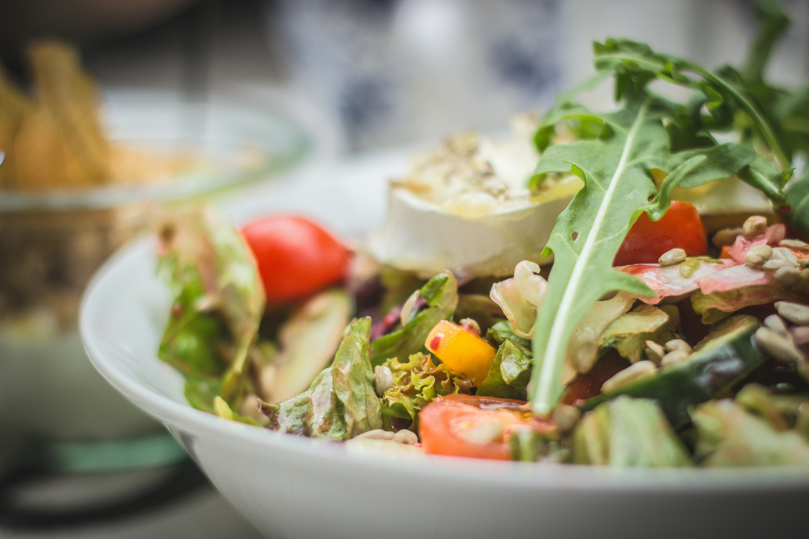
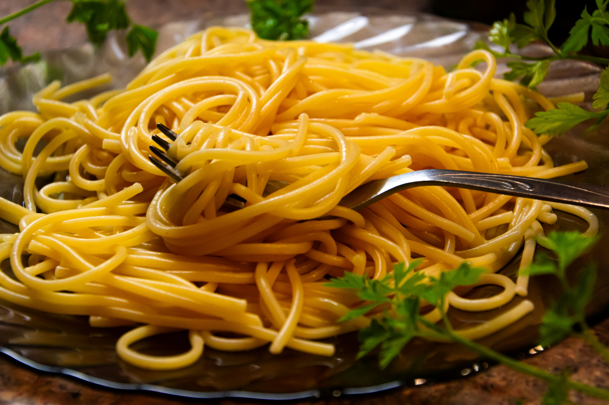

# Menu

# Przystawki

### *Na dobry początek.*

1. **Krem z pomidorów** (300g) - 19,90
2. **Oliwki w marynacie** (100g) - 12,99
3. **Deska wedlin i serów** (370g) - 47,90
4. **Gorąca Focaccia** (100g) - 13,50

## Włoska pizza klasyczna

### *Uwielbiane na całym świecie włoskie klasyki.*

|Lp.|Nazwa |Rozmiar: |30cm |50cm |60cm |
|---|------|---------|------|------|------|
| 1. | **Capricciosa** (sos z włoskich pomidorów, ser Mozarella, pieczarki, karczochy, szynka Prosciutto, czarne oliwki) | | 41,99 | 46,99 | 51,99 |
| 2. | **Prosciutto e Salame** (sos z włoskich pomidorów, ser Mozzarella, pieczarki, szynka Prosciutto, włoskie Salami) | | 41,99 | 46,99 | 51,99 |
| 3. | **Pancetta e Salame** (sos z włoskich pomidorów, ser Mozzarella, pieczarki, boczek Pancetta, włoskie Salami, ser Gorgonzola) | | 41,99 | 46,99 | 51,99 |
| 4. | **Quattro Stagioni** (*cztery smaki, każda ćwiartka ma inny składnik:* sos z włoskich pomidorów, ser Mozzarella, pieczarki, karczochy, szynka Prosciutto, włoskie Salami) | | 39,99 | 44,99 | 49,99 |
| 5. | **Tonno e Cipolla** (sos z włoskich pomidorów, ser Mozzarella, tuńczyk, cebula, kapary) | | 39,99 | 44,99 | 49,99 |
| 6. | **Calzone Valerio** (*pizza zamykana do środka*: sos z włoskich pomidorów, ser Mozzarella, szynka Prosciutto, pieczarki, rukola) | | 41,99 | 46,99 | 51,99 |
| 7. | **Prosciutto e Funghi** (sos z włoskich pomidorów, ser Mozzarella, pieczarki, szynka Prosciutto) | | 40,99 | 45,99 | 50,99 |
| 8. | **Quattro Formaggi** (sos z włoskich pomidorów, ser Mozzarella, ser Gorgonzola, ser Grana Padano, ser Pecorino Romano) | | 39,99 | 44,99 | 49,99 |
| 9. | **Prosciutto** (sos z włoskich pomidorów, ser Mozzarella, szynka Prosciutto) | | 39,99 | 44,99 | 49,99 |
| 10. | **Hawai** (sos z włoskich pomidorów, ser Mozzarella, ananas, szynka Prosciutto) | | 40,99 | 45,99 | 50,99 |

## Włoska pizza bianca

### *Pizze białe, charakterystyczne i popularne we Włoszech, bazujące na sosach śmietanowych, oliwie i innych włoskich dodatkach.*

|Lp.|Nazwa |Rozmiar: |30cm |50cm |60cm |
|---|------|---------|------|------|------|
| 1. | **Tartufo** (ser Mozzarella, pieczarki, szynka Prosciutto, krem truflowy) | | 43,99 | 48,99 | 52,99 |
| 2. | **Carciofi e Bufala** (ser Mozzarella, karczochy, szpinak, oliwa czosnkowa, orzechy włoskie, pesto z pietruszki, pomidory suszone, rukola, koperek) | | 42,99 | 47,99 | 52,99 |
| 3. | **Funghi di bosco** (sos śmietanowy, ser Grana Padano, grzyby leśne, ser Mozzarella, szynka Prosciutto, szczypiorek) | | 44,99 | 49,99 | 54,99 |

## Włoskie pizze wegańskie

### *Wegańskie pizze to doskonałe połączenia roślinnych dodatków z wyjątkowym, chrupiącym ciastem.*

| Lp. | Nazwa | Rozmiar: | 30cm | 50cm | 60cm |
|-----|-------|----------|------|------|------|
| 1. | **Verdure Miste** (sos z włoskich pomidorów, bakłażan z czosnkiem, oliwki, cebula, kapary, orzeszki pinii, bazylia) | | 40,99 | 45,99 | 51,99 |
| 2. | **Funghi Misti** (sos z włoskich pomidorów, miks grzybów leśnych, rukola, orzechy włoskie, krem balsamiczny o smaku orzechowo-gruszkowym) | | 39,99 | 44,99 | 49,99 |

## Sałatki

### *Mistrzowskie przepisy doskonałe w zestawie z pizzą.*

| Lp. | Nazwa | Porcja: | 250g | 360g |
|-----|-------|---------|------|------|
| 1. | **Insalata dalla Grecia** (ser feta, miks sałat, sos winegret, pomidorki koktajlowe, zielony ogórek, oliwki zielone, czerwona cebula, bazylia, rukola) | | 32,99 | 37,99 |
| 1. | **Insalata Terra e Mare** (miks sałat, pomarańcza, łosoś wędzony na zimno, ser Mozzarella, sos imbirowo - musztardowy z mango, liście mięty, szczypiorek, czarny sezam) | | 34,99 | 39,99 |

## Makarony

### *Makarony z samego serca Włoch bazujące na oryginalnych włoskich składnikach.*

|Lp.|Nazwa |Porcja: |500g |600g |
|---|------|--------|-----|-----|
| 1. | **Lasagna della Mamma** (sos z włoskich pomidorów, mielone mięso wieprzowe, makaron lasagne, czosnek, ser Mozzarella, sos beszamelowy, ser Grana Padano, bazylia) | | 39,99 | 44,99 |
| 2. | **Ravioli Spinaci al Burro** (ravioli ze szpinakiem, Ricottą i Grana Padano, maślany sos na bazie białego wina z nutą chrzanu, pomidory koktajlowe, zielony groszek, mięta, koperek.) | | 46,99 | 51,99 |
| 3. | **Spaghetti Rossi** (makaron spaghetti, kiełbasa Nduja, Pancetta, włoskie pomidory, ser Stracciatella, czerwona cebula z miodem, czosnek, groszek cukrowy) | | 39,99 | 44,99 |

## Desery

1. **Domowa Panna Cotta z szafranem i musem malinowym** (180g) - 18,99
2. **Tiramisu** (170g) - 22,99
3. **Sernik z Ricottą i Grana Padano** (160g) - 24,99

## Kawy

### *Przy włoskiej kawie rozmowy smakują lepiej*

| Lp. | Nazwa | Pojemność: | 150ml | 300g |
|-----|-------|------------|-------|------|
| 1.  | **Kawa Americano** | | 14,00 | 18,00 |
| 2.  | **Cappuccino** | | 14,00 | 18,00 |
| 3.  | **Flat White** | | 14,00 | 18,00 |
| 4.  | **Caffé Lattee** | | 14,00 | 18,00 |
| 5.  | **Caffé Frutteto** | | 16,00 | 20,00 |
